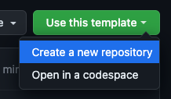
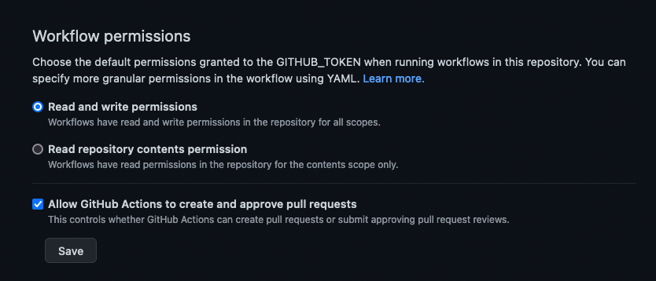
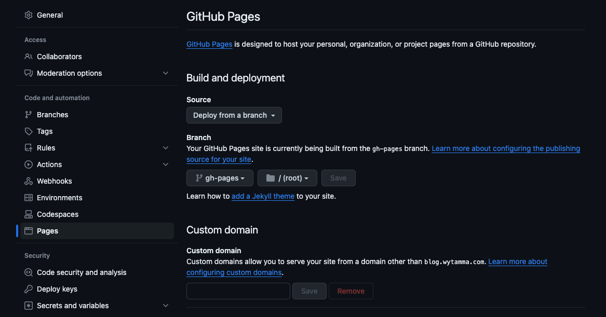
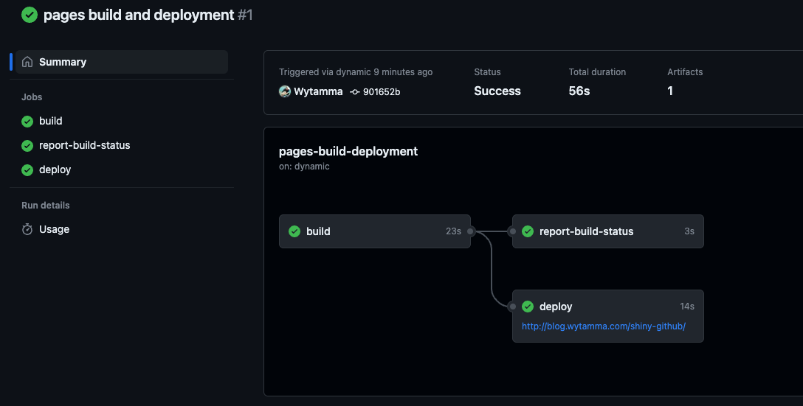

# Host Client Side Shiny Apps On Github For Free
[](https://github.com/Wytamma/shiny-github/actions/workflows/build.yml)

## Introduction

This is a simple guide to hosting client side web apps on github for free. This is a great way to host your web apps for free and also to learn about git and github.

## Steps

1. Create a github account if you don't already have one.
2. Use this repository as a template by clicking the green "Use this template" button.

[](https://github.com/new?template_name=shiny-github&template_owner=Wytamma)

> Note: You must create a public repo (unless you have github pro)

3. Ensure the workflow permissions are set to read and write.

Go to setting: `Actions` > `General` > `Workflow permissions` as follows:
Read and write permissions
(Workflows have read and write permissions in the repository for all scopes.)


3. Clone the repository to your local machine.

```bash
git clone <YOUR USERNAME>/<YOUR REPO>
```

Or use RStudio to clone the repository.

`RStudio` > `New Project` > `Version Control` > `Git` > `Repository URL`: \<YOUR USERNAME>/\<YOUR REPO>

4. Add your shiny app files to the `src` folder (You can use the example files to start with).

5. Commit and push your changes to github.
    
```bash
git add .
git commit -m "Add shiny app files"
git push
```

6. Back in your repository (on github.com). Go to the `Actions` tab and you should see a workflow running. This workflow will build your shiny app and deploy it to the gh-pages branch. Wait for the Action to finish.

> For details on what the workflow is doing see [build.yml](.github/workflows/build.yml)

7. Go to settings and scroll down to the `Pages` section. Select Deploy from branch as the source and select the `gh-pages` as the branch and click save.



The pages build and deployment action should start running. Once it's finished you should see a link to your shiny app. It may take a few minutes for the link to work.



## Example

Here is an example of a shiny app hosted on github pages: https://joshua-silver.shinyapps.io/iris/

## FAQ
> Why does is take so long to load?

As the shiny app is running in the client's browser, the app's dependencies must be downloaded to the client's browser. This can take a while depending on the size of the app and the client's internet connection. However, once the dependencies are downloaded once they will be cached in the client's browser and the app will load much faster in the future.

> Why does the app not load?

Client-side shiny apps only work with pre-compiled dependencies. This means that you cannot use packages that require compilation such as `sf` and `rstan`. At list of packages that can be used can be found at [https://repo.r-wasm.org/](https://repo.r-wasm.org/).

> The build action fail with the following error: `The requested URL returned error: 403`

Please change the repository setting (Go to `Actions` > `General` > `Workflow permissions`) as follows:
Read and write permissions
(Workflows have read and write permissions in the repository for all scopes.)
